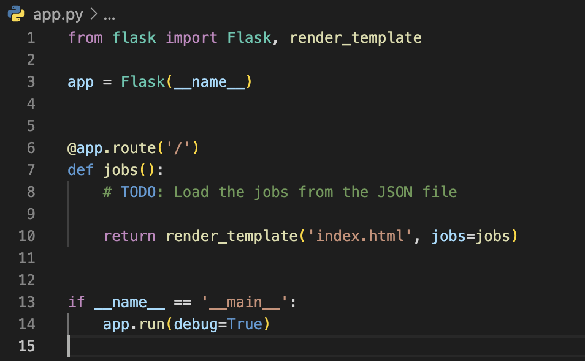
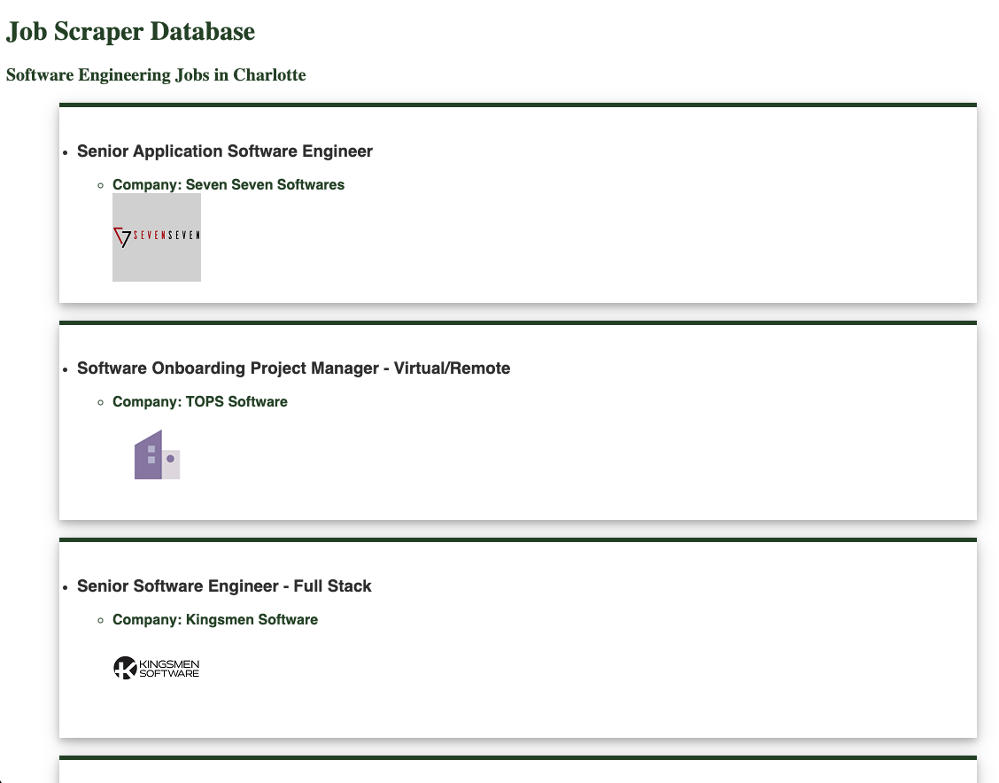

# Retrieving Data with JSON

## Description

This lab will teach you how to retrieve and display data dynamically for web applications using JSON. To complete these activities, you must finish Tasks 1-6 from the current sprint.

## Task 7: Setup Files and Flask

- Begin by adding the folders and files will need for this lab. All of these files are located in the GitHub repository, but you will need to add them locally to your directory for Tasks 4, 5, and 6. The new files/folders you will need are:
  - `templates` folder
    - `index.html` file
  - `static` folder
    - `style.css` file
  - `app.py` file
- Finish the `app.py` file so that it loads the json jobs data you scraped in the previous activity
- 
  
## Task 8: Put the Correct Data in the HTML

- Finish the various TODOs in the index.html file so that the correct data is displayed on the page.
- Screenshot your working application and save it for later submission.
- 

## Submission

- On Canvas, submit the screenshot of your working application.
